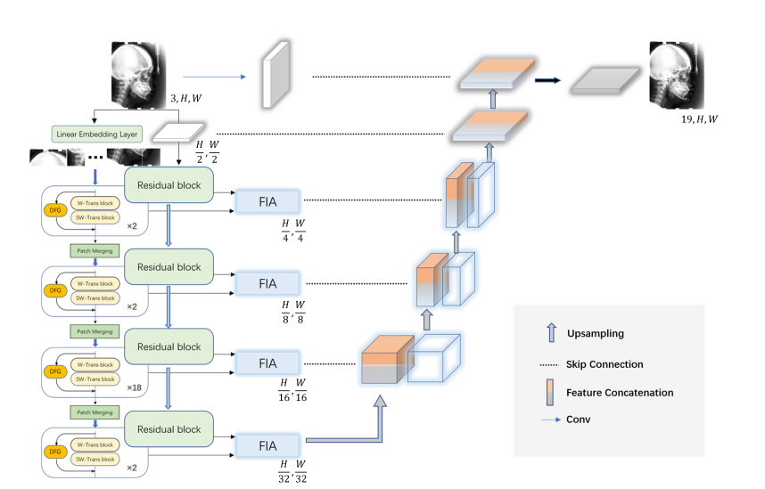
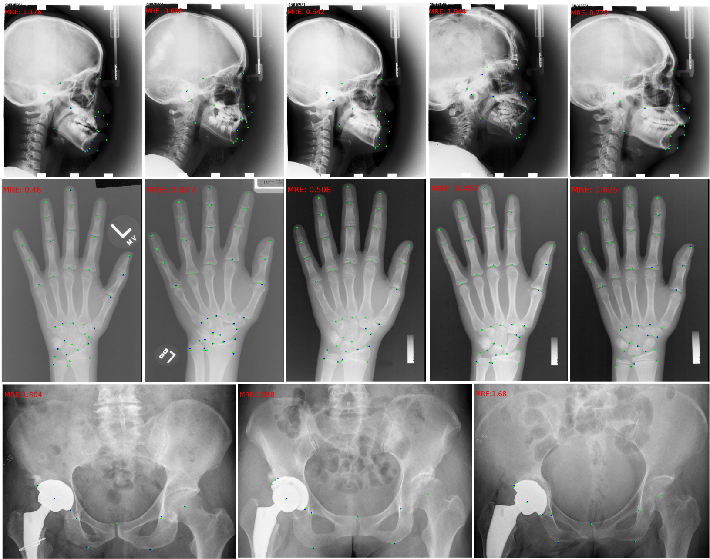

## Res-SwinFusion, a Deep Learning Model for Automatic Localization of Anatomical Landmarks in X-rays to Assist in Diagnosis and Surgical Planning.


## Data Preparation:
Download the [head](https://figshare.com/s/37ec464af8e81ae6ebbf), [hand](https://ipilab.usc.edu/research/baaweb) datasets.

Prepare datasets in the following directory structure. Take the head dataset as an example.

* data 
    * AnnotationsByMD      
    	* 400\_junior
    	* 400\_senior
    * RawImage      
    	* \*.bmp
  
 ## Examples:
<div align="center">
  
</div>
<p align="center">

<div align="center">
  
</div>
<p align="center">

Now:
```bash
python preprocessing.py
```

### Train
- Set the hyperparameter in the `config.py`
```bash
python main.py -p train
```

### Test
Change the model you want to load in `main.py` and results can be obtained from the folder 'outputs'.

You could manually run the test:
```bash
python main.py -p test
```

### Example
1. Download checkpoint: [Google Drive](https://drive.google.com/file/d/1IH60SB1BCV0tUNvlDW2DE8R6XGBShboQ/view?usp=sharing)|[坚果云](https://www.jianguoyun.com/p/DRgvDhAQhpiICRjTqcoEIAA )
2. Put it in `outputs/model`
3. Run commands:
```shell
python main.py -p pretrained 
```

